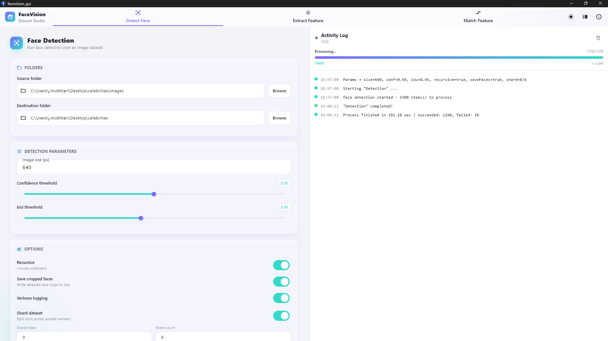
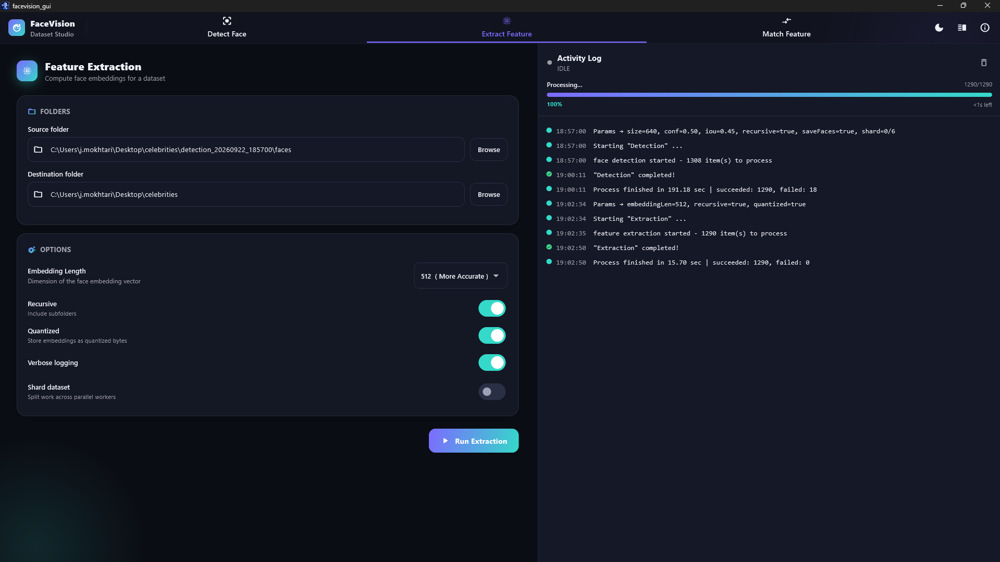

# FaceVision Dataset Studio

A simple desktop application for detecting faces, creating face features, and comparing image datasets — all without using the command line.

FaceVision Dataset Studio helps you work with large collections of images that contain faces. It brings the main steps of a face-processing workflow into one easy-to-use application.

## Technical Details

FaceVision Dataset Studio is built with **Flutter** and **Rust**, connected through **flutter_rust_bridge**.

The application uses Flutter for the desktop user interface, providing a modern and responsive experience, while Rust handles the computationally intensive face-processing work behind the scenes. This approach combines two strengths:

* **Flutter** provides a polished, consistent, and user-friendly interface.
* **Rust** provides a fast, efficient, and reliable backend for processing large image datasets.
* **flutter_rust_bridge** connects the two layers so they can work together as a single desktop application.

The backend is designed around an AI-powered face-processing workflow, allowing the application to perform demanding operations without requiring users to understand or interact with the underlying processing system.

## The Application Window

FaceVision Dataset Studio is a single-page application with three main tabs:

* **Detection** — Find faces in your images.
* **Recognition** — Extract useful face features from detected faces.
* **Matching** — Compare faces across different datasets.

The application also includes:

* **Activity Panel** — View progress, status messages, warnings, and errors. Use the panel button to show or hide it.
* **Light and Dark Mode** — Use the appearance button in the top-right corner to switch between light and dark mode.
* **About** — Inforamtion about the application.

### Detect Face

Use **Detect Face** to find faces in a folder of images. A higher confidence setting makes detection more selective, while a lower setting may detect more possible faces.

### Feature Extraction

Use **Feature Extraction** to create a numerical representation of each face.These features allow faces to be compared later without having to compare the original images directly.

### Match Feature

Use **Match Feature** to compare two collections of face features. For example, you might have:

* A **Probe** dataset containing faces you want to investigate
* A **Reference** dataset containing faces you want to compare against

The application compares the two datasets and saves the results in your chosen output folder.

### Monitoring Progress

The activity panel keeps you informed while an operation is running. You may see:

* Overall progress
* Number of items processed
* Estimated time remaining
* Informational messages
* Warnings
* Errors
* Successful operations

### Keyboard Shortcuts

|   Shortcut    |           Action                |
| --------------| ------------------------------- |
| `Ctrl + 1`    | Open Detect Face                |
| `Ctrl + 2`    | Open Feature Extraction         |
| `Ctrl + 3`    | Open Match Feature              |
| ``Ctrl + ` `` | Show or hide the activity panel |

---
